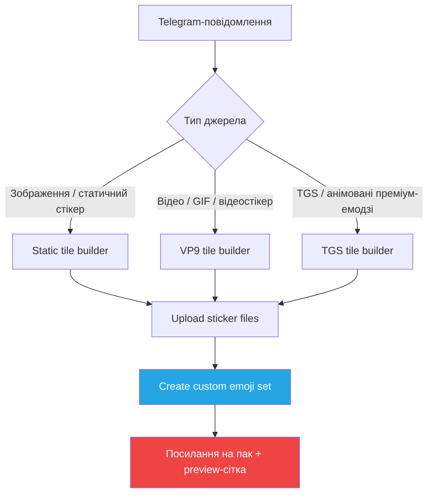
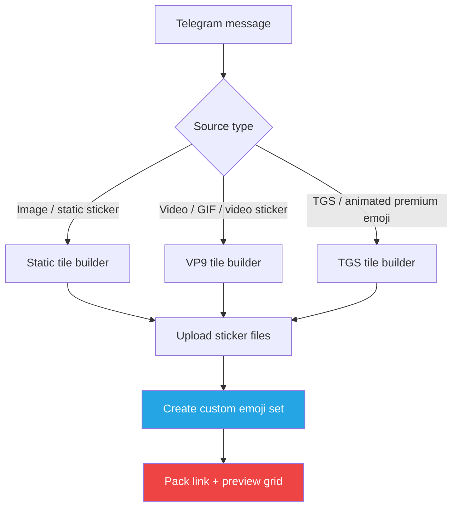

# shemoji

<p align="center">
  <a href="#ukrainian">🇺🇦 Українська</a>
  ·
  <a href="#english">🇬🇧 English</a>
</p>

<p align="center">
  
</p>

<p align="center">
  
  
  
  
</p>

---

<a id="ukrainian"></a>

## 🇺🇦 Українська

`shemoji` — це Telegram-бот, який перетворює зображення, відео, GIF, відеоповідомлення, стікери та преміум-емодзі на набори кастомних емодзі для Telegram.

Надішліть медіа боту, і він розріже вихідний файл на емодзі-плитки 100x100, завантажить їх як набір кастомних емодзі та надішле вам готову сітку для використання.

### Можливості

| Можливість | Деталі |
| --- | --- |
| Медіа на вході | Фото, зображення файлом, відео, GIF, відеоповідомлення, статичні стікери, відеостікери, `.tgs`-стікери, преміум-емодзі |
| Результат | Набір `custom_emoji` для Telegram і посилання `t.me/addemoji/...` |
| Керування сіткою | Автоматична сітка за пропорціями або точні розміри в підписі (наприклад, `5x5`, `6x4`, `8x6`) |
| Анімації | Відео/GIF перетворюються на VP9 `.webm`; `.tgs`-файли залишаються векторними `.tgs` |
| Груповий режим | Надішліть `/emoji` у відповідь на повідомлення в групі, щоб бот згенерував і надіслав тільки емодзі-сітку |
| Особисті налаштування | Відступи (padding) та автоматичний вибір розміру для кожного користувача через `/settings` |
| Надійність | Обмежена паралельність задач, паралельне завантаження файлів, послідовні зміни в наборах стікерів, повторні запити (ретраї) до Telegram API |

### Як це працює



### Поведінка в Telegram

| Контекст | Поведінка |
| --- | --- |
| Приватний чат | Повне повідомлення про готовий набір, посилання, кнопки перейменування/видалення, сітка для попереднього перегляду, список наборів через `/view` |
| Груповий чат | `/emoji` використовується як відповідь (reply); бот відповідає на вихідне повідомлення готовою емодзі-сіткою |
| Преміум-емодзі | Бот знаходить оригінальний файл стікера та зберігає адаптивне перефарбовування (adaptive repainting), якщо Telegram його підтримує для цього файлу |
| TGS fallback | Якщо Telegram відхиляє `.tgs`-сітку автоматичного розміру, `shemoji` пробує створити менші сітки, перш ніж видати помилку |

### Вимоги

- Python 3.12+
- `ffmpeg` з підтримкою VP9
- Токен Telegram-бота від [@BotFather](https://t.me/BotFather)

### Швидкий старт

```bash
git clone https://github.com/kirillshsh/shemoji.git
cd shemoji

python3 -m venv .venv
source .venv/bin/activate
pip install -r requirements.txt

cp .env.example .env
```

Відредагуйте `.env`:

```env
BOT_TOKEN=123456:your_token
```

Запустіть `shemoji`:

```bash
python -m shemoji
```

### Команди

| Команда | Для чого |
| --- | --- |
| `/start` | Опис і базове використання |
| `/settings` | Налаштування відступів і автоматичного розміру |
| `/view` | Збережені набори кастомних емодзі |
| `/emoji` | Команда тільки для груп (працює як reply) для створення сітки з повідомлення |

### Структура репозиторію

```
shemoji/
├── assets/
│   └── readme/                 # Зображення для README
├── shemoji/
│   ├── bot.py                  # Runtime bootstrap
│   ├── handlers.py             # Telegram handlers для команд і callback
│   ├── builder.py              # Pipeline створення паків
│   ├── media.py                # Нарізка зображень, відео і TGS
│   ├── stickers.py             # Helpers для Telegram sticker set
│   ├── storage.py              # SQLite settings і записи збережених паків
│   ├── sources.py              # Визначення джерела з Telegram-повідомлення
│   ├── views.py                # Повідомлення бота
│   └── telegram_client.py      # Retry-aware Telegram Bot wrapper
├── .env.example
└── requirements.txt
```

### Нотатки

- Статичні кастомні емодзі — це `.webp`-плитки `100x100`.
- Відео-емодзі — це VP9 `.webm`-плитки `100x100` без звуку.
- Анімовані `.tgs`-стікери та преміум-емодзі нарізаються як `.tgs`-плитки.
- Клієнти Telegram можуть по-різному відображати попередній перегляд кастомних емодзі, надісланих від імені бота; посилання на набір залишається головним джерелом.

---

<a id="english"></a>

## 🇬🇧 English

`shemoji` is a Telegram bot that turns images, videos, GIFs, video messages, stickers, and premium emoji into Telegram custom emoji packs.

Send media to the bot, and it will slice the source into 100x100 emoji tiles, upload them as a custom emoji sticker set, and return a ready-to-use grid.

### Highlights

| Capability | Details |
| --- | --- |
| Media input | Photos, image files, videos, GIFs, video messages, static stickers, video stickers, `.tgs` stickers, premium emoji |
| Output | Telegram `custom_emoji` sticker set plus `t.me/addemoji/...` link |
| Grid control | Automatic grid by aspect ratio, or explicit captions like `5x5`, `6x4`, `8x6` |
| Animation path | Video/GIF sources become VP9 `.webm`; `.tgs` sources stay vector `.tgs` |
| Group mode | Reply with `/emoji` to a message in a group to generate and receive only the assembled emoji grid |
| Personal settings | Per-user padding and automatic size controls via `/settings` |
| Reliability | Bounded concurrent jobs, parallel uploads, serialized sticker-set mutations, Telegram retry handling |

### How it works



### Telegram behavior

| Context | Behavior |
| --- | --- |
| Private chat | Full completion message, pack link, rename/delete buttons, preview grid, and pack list via `/view` |
| Group chat | `/emoji` must be used as a reply; the bot answers the source message with the emoji grid |
| Premium emoji | The bot resolves the original sticker file and preserves adaptive repainting when Telegram exposes it |
| TGS fallback | If Telegram rejects an auto-sized `.tgs` grid, `shemoji` attempts to build smaller grids before failing |

### Requirements

- Python 3.12+
- `ffmpeg` with VP9 support
- Telegram bot token from [@BotFather](https://t.me/BotFather)

### Quick Start

```bash
git clone https://github.com/kirillshsh/shemoji.git
cd shemoji

python3 -m venv .venv
source .venv/bin/activate
pip install -r requirements.txt

cp .env.example .env
```

Edit `.env`:

```env
BOT_TOKEN=123456:your_token
```

Run `shemoji`:

```bash
python -m shemoji
```

### Commands

| Command | Purpose |
| --- | --- |
| `/start` | Intro and basic usage |
| `/settings` | Padding and automatic size controls |
| `/view` | Saved custom emoji packs |
| `/emoji` | Group-only reply command for building a grid from another message |

### Repository Layout

```
shemoji/
├── assets/
│   └── readme/                 # README preview assets
├── shemoji/
│   ├── bot.py                  # Runtime bootstrap
│   ├── handlers.py             # Telegram command and callback handlers
│   ├── builder.py              # Pack build pipeline
│   ├── media.py                # Image, video, and TGS tiling
│   ├── stickers.py             # Telegram sticker-set creation helpers
│   ├── storage.py              # SQLite settings and saved pack records
│   ├── sources.py              # Telegram message source detection
│   ├── views.py                # Bot message rendering
│   └── telegram_client.py      # Retry-aware Telegram Bot wrapper
├── .env.example
└── requirements.txt
```

### Notes

- Static custom emoji are `100x100` `.webp` tiles.
- Video custom emoji are `100x100` VP9 `.webm` tiles without audio.
- Animated `.tgs` stickers and premium emoji are sliced as `.tgs` custom emoji tiles.
- Telegram clients may differ in how they render custom emoji previews sent by bots; the pack link remains the source of truth.
